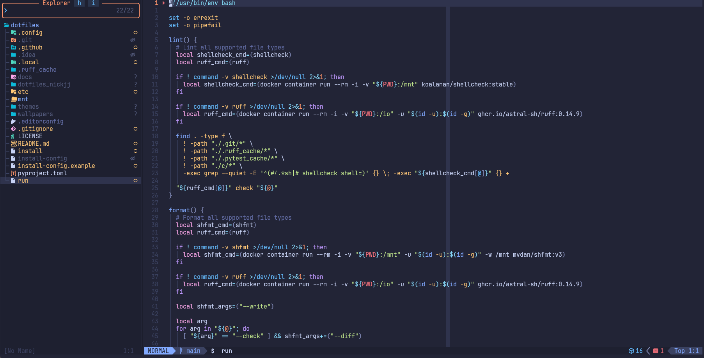
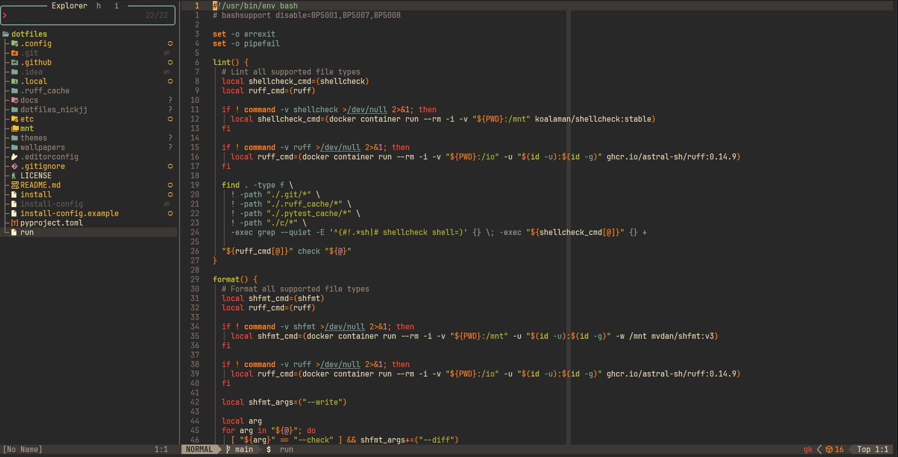

# 🥡 DotFriedRice

*An opinionated but customizable set of configs and scripts designed to help
you quickly set up your system. It's aimed at anyone who deeply cares about how
they use computers (developers, power users, etc.).*

In 1 command and ~5 minutes you can get a new or existing system set up with
terminal based tools and workflows on Arch / Debian based Linux distros (WSL 2
included) and macOS.

If you're on an Arch based distro you can optionally add a complete
[niri](https://github.com/niri-wm/niri) based desktop environment in addition
to having all of the command line tools.

### Philosophy

Just like fried rice, you can mix and match an assortment of flavors.

I deeply understand one person's bloat is another person's treasure. All
packages, configs and symlinks are configurable before you modify your system.
A mini-goal of this project is to avoid needing to fork this project while
still giving you a reasonable amount of control, but if you want to use a fork
that's fine too.

Your machine is yours. If you want to dual boot, do it up. If you want multiple
users, sure thing. If you don't want to encrypt your drive, no problem.
Everyone is welcome here and you have full control.

## 🥢 What's in the Box?

### Command line

🛟 *Supports **Arch Linux**, both vanilla and Arch based distros such as
**CachyOS**, etc.. It also supports **Debian**, **Ubuntu** (vanilla and all
flavors), **macOS** and there's **WSL 2** support for any supported Linux
distro.*

#### Highlights

- Tweak out your shell (zsh)
- Set up tmux
- Fully configure Neovim
- Install modern CLI tools and programming languages

### (Optional) Scrolling / tiling desktop environment

🛟 *Supports **Arch Linux**, both vanilla and Arch based distros such as **CachyOS**, etc.*

#### Highlights

- ...includes everything in the command line version, plus:
- niri *(Wayland compositor)*, Waybar *(status bar)*, Walker *(app launcher)* and friends
- Hotkey focused but tons of mouse / trackpad support
- Prefer TUI (Terminal User Interface) apps over GUI apps when possible
- Development / media creation focused apps are ready to go

#### Why niri and not XYZ?

It's resource efficient, extremely stable, lightning fast, infinitely
tweakable, intuitively handles scrolling / tiling / floating windows,
integrates awesomely with multiple monitors, actively developed, well thought
out, has great documentation and the author is very helpful.

niri feels like a perfect match and I wanted to make a special call out because
it's *that* good. I'm the "I was there 3,000 years ago" meme from Windows 2000,
XP, 7, 10 and also macOS on company issued laptops. Nothing I have ever used in
~25 years has approached how I feel using this set up. It's not even close (yes
I tried Hyprland too).

Nick Janetakis recorded a [demo video](https://www.youtube.com/watch?v=7XmD5UyyhZQ)
showcasing niri day-to-day — worth watching, though this repo evolves so the video
may not reflect the latest state.

### Packages, scripts and more

There's docs with a list of [packages](./_docs/packages.md) and
[scripts](./_docs/scripts.md) along with what they're being used for and why.

The source of truth can always be found within the files at
[_install/default/](./_install/default/). You'll find files related to
packages, standalone scripts, programming languages and more.

## 🧾 Documentation

- [Themes](#-themes)
- [Quickly Get Set Up](#-quickly-get-set-up)
- [FAQ](#-faq)
  - [How to personalize DotFriedRice?](#how-to-personalize-dot-fried-rice)
  - [How to theme custom apps?](#how-to-get-theme-custom-apps)
  - [How to add custom themes?](#how-to-add-custom-themes)
  - [How to install Arch Linux?](#how-to-install-arch-linux)
  - [How to get started with the desktop environment?](#how-to-get-started-with-the-desktop-environment)
  - [How much resources does the desktop environment use?](#how-much-resources-does-the-desktop-environment-use)
  - [How to get set up on Windows to install WSL 2 and a distro?](#how-to-get-set-up-on-windows-to-install-wsl-2-and-a-distro)
- [Feedback and Code Contributions](#-feedback-and-code-contributions)
- [About the Author](#-about-the-author)

## 🎨 Themes

Themes are chosen for strong contrast ratios and clear visibility in recordings,
following the approach from [Nick Janetakis's channel](https://www.youtube.com/@NickJanetakis/videos). DFR
(DotFriedRice) supports easily switching between themes and you can create
custom themes too.

You can look in the [_themes/](./_themes/) directory to see which apps are
themed and [add additional apps](#how-to-theme-custom-apps) too. If you don't
like the included themes that's no problem, you can [add custom
themes](#how-to-add-custom-themes) and remove the defaults.

### Tokyonight Moon



### Gruvbox Dark (Medium)



### Setting a theme

```sh
# Get a full list of themes by running: dfr-theme-set --list
# There's also a --menu flag to preview themes in the desktop environment.
#
# Optionally you can skip adding a theme name and the next theme will be picked.
dfr-theme-set THEME_NAME
```

When switching themes all GTK apps will live update (Firefox, Thunar, GIMP,
etc.) and most terminal apps will live update too. If you have a bunch of
shells already open in tmux you can run the `SZ` alias — Nick Janetakis's
[source zsh](https://nickjanetakis.com/blog/running-commands-in-all-tmux-sessions-windows-and-panes)
technique — to source new theme related configs.

### Wallpapers

*Only available when the desktop environment is set up.*

```sh
# Get a full list of wallpapers by running: dfr-theme-set-bg --list
# There's also a --menu flag to preview wallpapers.
#
# Optionally you can skip adding a wallpaper name and the next wallpaper will be picked.
dfr-theme-set-bg WALLPAPER_NAME
```

You can cycle between wallpapers that are compatible with the active theme.
This is controlled through the `_theme.json` file in each theme's directory,
it's under the `wallpaper.synergy` object.

## ✨ Quickly Get Set Up

There's an automated script to get you going quickly (we'll go over running it
soon). It handles checking system compatibility and installing / configuring
everything in a few minutes.

You'll be able to choose where you want to clone DotFriedRice to and also
have an opportunity to review and edit what gets installed if you have
different tastes.

### 🌱 On a fresh system where you'll be running Arch Linux?

If you plan to use the desktop environment you'll want to set up a bootable USB
stick with the official [Arch Linux
ISO](https://fastly.mirror.pkgbuild.com/iso/latest/) and then run the official
[archinstall](https://wiki.archlinux.org/title/Archinstall) script. There is a
[FAQ item covering that](#how-to-install-arch-linux) with video guides.

### 🔌 On an existing system (WSL 2, macOS or native Linux)?

**For the command line version**, it's unlikely you'll run into any conflicts
when installing DotFriedRice.

If you're on WSL 2, there's a dedicated FAQ item for [getting set up with WSL 2
and installing a
distro](#how-to-get-set-up-on-windows-to-install-wsl-2-and-a-distro). Please
follow that before installing DotFriedRice.

If you're on macOS, you're good to go and don't need to do anything extra.

If you're on an Arch based distro, you're good to go and don't need to do anything extra.

If you're on Debian / Ubuntu the only thing you need installed ahead of time is
`curl` which you can do with `apt-get update && apt-get install --yes
--no-install-recommends curl`.

**For the desktop environment** on Arch based distros, DotFriedRice won't modify
other environments you have. It will install everything and configure your
user's shell to launch niri after logging in. It won't interfere with a login
manager if you have one.

With that said, if you plan to go all-in with the desktop environment it's
worth considering [backing up your files](https://github.com/nickjj/bmsu) (Nick Janetakis's bmsu script) and
creating a fresh install but it's not technically required if you do manual
cleanup. It's up to you!

### ⚡️ Install

**You can download and run the bootstrap script with this 1 liner:**

```sh
bash <(curl -fsSL https://raw.githubusercontent.com/sassdavid/dotfriedrice/main/bootstrap)
```

You'll be presented with a y/n prompt before installing anything of substance.

*If you're not comfortable blindly running a script on the internet, that's no
problem. You can view the [bootstrap script](./bootstrap) to see exactly what
it does. The bottom of the file is a good place to start. Alternatively you can
look around this repo and reference the config files directly without using any
script.*

🐳 **Try the command line version in Docker without modifying your system:**

```sh
# Start a Debian container, we're passing OS_IN_CONTAINER to be explicit we're in a container.
docker container run --rm -it -e "OS_IN_CONTAINER=1" -v "${PWD}:/app" -w /app debian:stable-slim bash

# Copy / paste all 3 lines into the container's prompt and run it.
#
# Since we can't open a new terminal in a container we'll need to manually
# launch zsh and source a few files. That's what the last line is doing.
apt-get update && apt-get install --yes --no-install-recommends curl \
  && bash <(curl -fsSL https://raw.githubusercontent.com/sassdavid/dotfriedrice/main/bootstrap) \
  && zsh -c ". ~/.config/zsh/.zprofile && . ~/.config/zsh/.zshrc; zsh -i"
```

*Keep in mind with the Docker set up, unless your terminal is already
configured to use Tokyonight Moon then the colors may look off. That's because
your local terminal's config will not get automatically updated.*

**🚀 Keeping things up to date and tinkering**

Once you've installed DotFriedRice you can run `cd $DOTFRIEDRICE_PATH` to
manage it moving forward. There's also the `dfr` alias to move into that
directory and open it in your configured editor.

Here's a few handy commands you can run from anywhere:

- `dotfriedrice`
  - Install everything based on your local copy of DotFriedRice (you can run this regularly)
  - Keeps your system up to date and applies local config changes
- `dotfriedrice --skip-system-packages | -S`
  - The same as above but skip installing or updating packages
  - Helps regenerate symlinks, configs and everything else without modifying packages
- `dotfriedrice pull`
  - Pulls in the latest remote commits but doesn't install anything
  - Lets you review any changes locally before you install anything
- `dotfriedrice update`
  - Pulls in the latest remote commits and installs everything
  - Shortcut to pull and install in 1 command
- `dotfriedrice diff-config`
  - Compare your local `dotfriedrice-config` to the local `dotfriedrice-config.example`
  - Helps keep your git ignored `dotfriedrice-config` in sync with new options
- `dotfriedrice diff`
  - Compare what you have locally vs the latest remote commits
  - See what will change if you `dotfriedrice pull` without modifying your git tree
- `dotfriedrice new-commits`
  - Show new remote commits that do not exist locally
  - Present a quick list of what's available to pull locally
- `dotfriedrice changelog`
  - Show all remote commits
  - Present a quick list of all commits to see what has changed over time
- `dotfriedrice local-files`
  - Show all local git ignored files such as configs, history and scripts
  - Useful to see everything not committed and for optionally backing up those files
    - Example: `dotfriedrice local-files | xargs zip local-files.zip`
- `dotfriedrice debug`
  - Show DotFriedRice environment and system information
  - Can be used to help report issues and check your system stats

You can always see a list of commands by running `dotfriedrice --help`.

### 🍚 Make it your own

If you just ran the dotfriedrice script and haven't done so already please
close your terminal and open a new one. If you've set up GUI mode with Arch
Linux you'll want to reboot instead.

There's a few ways to customize DotFriedRice from customizing the
[dotfriedrice-config](./dotfriedrice-config.example) which is git ignored to
forking it. The first method lets you adjust which packages and programming
languages get installed as well as configure a number of other things without
using a fork.

Before you start customizing other files, please take a look at the
[personalization question in the FAQ](#how-to-personalize-dot-fried-rice).

#### Git identities

If you work across multiple contexts (personal, work, clients) DotFriedRice
has a multi-identity git system that automatically switches your `user.name`
and `user.email` based on which directory you're working in.

During the install the script will prompt you for a name and email per
identity. These get saved to `~/.config/git/config.local.{name}` and a
`~/.config/git/config.local.includes` file is auto-generated with
[`includeIf "gitdir:..."`](https://git-scm.com/docs/git-config#_conditional_includes)
directives so git picks the right one automatically.

The default identities and their source paths are:

| Identity    | Directories                           |
|-------------|---------------------------------------|
| `personal`  | `~/src/github/`                       |
| `work`      | `~/src/codecommit/`, `~/src/gerrit/`  |
| `bitbucket` | `~/src/bitbucket/`                    |

You can replace the defaults or add your own identities in `dotfriedrice-config`:

```sh
# Replace all defaults with your own:
declare -A GIT_IDENTITIES=(
  ["personal"]="${HOME}/src/github/"
  ["work"]="${HOME}/src/work/"
)

# Or just add on top of the defaults:
GIT_IDENTITIES_EXTRAS["client"]="${HOME}/src/client/"
```

Each identity config also includes commented-out lines for SSH commit signing
via 1Password. The install script auto-detects the signing binary on all
supported platforms:

- **macOS** — `/Applications/1Password.app/Contents/MacOS/op-ssh-sign`
- **Linux** — `/opt/1Password/op-ssh-sign` (DEB, RPM, tar.gz, AUR) or the
  Snap path, whichever is present
- **WSL 2** — `op-ssh-sign-wsl.exe` for the MSIX installer (8.11.18+) or
  the legacy path for the older EXE installer (8.11.16 and earlier)

If you install 1Password after the initial dotfriedrice setup, re-run `./install`
and it will patch the signing program path into your existing identity configs.
The `program =` line is pre-filled but left commented out — to activate signing
you only need to uncomment the `[gpg "ssh"]` block and add your key fingerprint
to `signingkey` in `~/.config/git/config.local.{name}`.

### 🪟 Extra WSL 2 steps

In addition to the Linux side of things, there's a few config files that I have
in various directories of this repo. These have long Windows paths and are in
the `mnt/c/` directory.

It would be expected that you copy those over to your system while replacing
"sassd" with your Windows user name if you want to use those things. The
Microsoft Terminal config will automatically be copied over to your user's
path.

It's expected you're running WSL 2 with WSLg support to get clipboard sharing
to work between Windows and WSL 2. You can run `wsl.exe --version` from WSL 2
to check if WSLg is listed. Chances are you have it since it has been supported
since 2022! All of this should "just work". If clipboard sharing isn't working,
check your `.wslconfig` file in your Windows user's directory and make sure
`guiApplications=false` isn't set.

*If you see `^M` characters when pasting into Neovim, that's a Windows line
ending. That's because WSLg's clipboard feature doesn't seem to handle this
automatically. If you paste with `CTRL+SHIFT+v` instead of `p` it'll be ok. I
guess the Microsoft Terminal does extra processing to fix it for you.*

Pay very close attention to the `mnt/c/Users/sassd/.wslconfig` file because it
has values in there that you will very likely want to change before using it.
[Nick Janetakis's commit message](https://github.com/nickjj/dotfriedrice/commit/d0f1fc2622204b809cf7fcbb1a82d45b451064c4) goes into the details.

Also, you should reboot or from PowerShell run `wsl --shutdown` and then
re-open your WSL instance to activate your `/etc/wsl.conf` file (the
dotfriedrice script created this).

You may have noticed I don't enable systemd within WSL 2. That is on purpose.
I've found it delays opening WSL 2 by ~10-15 seconds and also any systemd
services were delayed from starting by ~2 minutes.

#### 1Password SSH Agent Integration

If 1Password is installed on Windows the install script automatically detects
it and configures `GIT_SSH`, `GIT_SSH_COMMAND` and the `ssh` / `ssh-add` /
`scp` aliases to point to the Windows OpenSSH client. This is required for
Git and SSH commands in WSL 2 to talk to the 1Password SSH agent on the
Windows side.

To finish the setup on the 1Password side:

1. Follow the official setup guides:
    - [Get started with 1Password SSH agent](https://developer.1password.com/docs/ssh/get-started/)
    - [WSL 2 integration details](https://developer.1password.com/docs/ssh/integrations/wsl/)

If auto-detection didn't run (e.g. 1Password was installed after you ran the
install script), you can add the configuration manually in the `.local` files:

- In your `~/.config/zsh/.zprofile.local`:
  ```sh
  export GIT_SSH="/mnt/c/Program\ Files/OpenSSH/ssh.exe"
  export GIT_SSH_COMMAND="/mnt/c/Program\ Files/OpenSSH/ssh.exe"
  ```
- In your `~/.config/zsh/.aliases.local`:
  ```sh
  alias ssh="/mnt/c/Program\ Files/OpenSSH/ssh.exe"
  alias ssh-add="/mnt/c/Program\ Files/OpenSSH/ssh-add.exe"
  alias scp="/mnt/c/Program\ Files/OpenSSH/scp.exe"

  alias ssh2="/usr/bin/ssh"
  ```

For SSH commit signing see the [Git identities](#git-identities) section above.

## 🔍 FAQ

### How to personalize DotFriedRice?

The [dotfriedrice-config](./dotfriedrice-config.example) lets you customize a
few things but chances are you'll want to personalize more than what's there,
such as various Neovim settings. Since this is a git repo you can always do a
`dotfriedrice pull` or `git pull` to get the most up to date code, but then
you may find yourself clobbering over your changes.

We have a few reasonable options without custom branches or forking:

- For minor changes like adjusting which packages get installed, the install config file lets you do that
- For minor config changes some tools let you include config files, so any git ignored `.local` files you see is a way to customize them without needing to adjust the main config
- For major config changes can configure the `CONFIG_INSTALL` commands
to symlink other files and directories that are git ignored, this lets you keep
your "real" files in the DotFriedRice repo with a different name or keep them in `~/.config` directly, it's up to you!

If the above isn't enough, or maybe you want things more streamlined you can
`git checkout -b personalized` and now you're free to make whatever changes you
want on your custom  branch. When it comes time to pull down future updates you
can run a `git pull origin main` and then `git rebase main` to integrate
any updates.

Another option is to fork this repo and use that, then periodically pull and
merge updates. It's really up to you. By default DotFriedRice will add an
`upstream` git remote that points to this repo for easy comparison.

I personally use DotFriedRice on 3 different devices with different operating
systems and haven't forked or created separate branches on any of them. I just
tweaked the install config.

### How to theme custom apps?

You'd add its theme file to each theme in [_themes/](./_themes) and update the
[dotfriedrice](./dotfriedrice) script's `set_theme` function to symlink the
config. If the app you're theming has no dedicated config file, you can copy
what I did for the Microsoft Terminal in `set_theme`.

Happy to assist in your issue / PR to answer questions if you want to
contribute your change.

### How to add custom themes?

1. Locate the [_themes/](./_themes) directory in this repo
2. Copy one of the existing themes' directory
3. Rename your directory, this will be your theme's name
4. Adjust all of the colors as you see fit

Switch to it by running `dfr-theme-set NEW_THEME_NAME` and use the name you
picked in step 3.

If you added a theme with good contrast ratios please open a pull request to
get it added to this project.

### How to install Arch Linux?

Nothing here is too specific to DotFriedRice, it's general knowledge on
setting up Arch but I wanted to include these steps to help get things cooking.

#### Create a bootable USB drive

Here's a [written and video
tutorial](https://nickjanetakis.com/blog/create-bootable-arch-usb-on-linux-macos-with-cat-or-rufus-on-windows)
by Nick Janetakis for Windows, Linux and macOS.

#### After booting from the USB drive

- Follow any instructions it says before running `archinstall`
  - For example if you use Wi-Fi you'll want to run `iwctl` to [set up your network](https://wiki.archlinux.org/title/Iwd#iwctl):
    - `iwctl`
      - `device list` shows devices such as `wlan0` which we'll use below
      - `station wlan0 scan` searches for networks (no output is normal)
      - `station wlan0 get-networks` lists your Wi-Fi networks
      - `station wlan0 connect <NETWORK_NAME>` prompts you for your password
      - `exit` brings you back to your shell
      - You should be connected to the internet at this point
        - Verify with `ping example.com` and hit CTRL+c to stop

#### Run `archinstall` from your shell

If you prefer video, [here's a
walkthrough](https://nickjanetakis.com/blog/walking-through-a-minimal-arch-linux-set-up-with-archinstall)
by Nick Janetakis of what's listed below. Keep in mind the archinstall script changes over time.
The steps listed below will always have the latest updates. Even if the video
gets slightly outdated because a menu item changed the general tips and
concepts still apply!

The script guides you pretty well. Here's a few important callouts in the order
they appear in the menu. The callouts are mostly my opinions, you can of course
choose other options and have things work. The goal of this guide isn't to
dictate what you do, it's to help you avoid analysis paralysis and see what's
configurable before you do it.

*Nothing you choose will happen immediately, you'll get to review everything at
the end before anything happens. Generally speaking you'll be using enter to
select options, escape to go back, the arrow keys to change selections and
space to toggle checkboxes.*

- **Archinstall language**:
  - Pick what makes sense for your location
- **Locales**:
  - Pick what makes sense to you for all of the sub-sections
- **Mirrors**:
  - Select a region close to where your live
  - *Optional repositories*:
    - You can skip this unless you have reasons otherwise
- **Disk configuration**:
  - If you go with the default "best effort" it will wipe your full drive:
    - This is reasonable if you're *not* dual booting, if you dual boot you'll want to manually set this up
    - Make sure the correct drive you want wiped is selected!
    - For the file system type, I went with `ext4` given how mature it is but `btrfs` is also mostly ok, if you're not sure or don't know what's different just choose `ext4`
    - Now it asks if you want a separate partition for your home directory, I chose no because I always end up wanting to adjust the size later and prefer skipping LVM but it's up to you of course
    - Review the info, you should see `/boot` and `/` (root) partitions at the very least
  - *Disk encryption*:
      - It's up to you, I would, choose to encrypt all of your non-boot partitions and set a good password, then double confirm you can remember this password, it's very important
      - After choosing LUKS as the type and your password, pick which partitions to wipe + encrypt, encrypt at least the root partition and skip the boot partition
- **Swap**:
  - It's up to you, I kept it enabled with zram which was the default
- **Bootloader**:
  - I rolled with `systemd-boot` which is the default
  - *Unified kernel images*:
    - I left this turned off but I suggest reading up on this more if you're interested
- **Kernels**:
  - The normal kernel is likely fine which is the default but feel free to choose otherwise
- **Hostname**:
  - Picking a cool name will probably be the [longest time](https://xkcd.com/910/) you spend in the installer
  - You can always change it afterwards, don't sweat it!
- **Authentication**:
  - *Root password*:
    - Definitely set a password and don't forget it
  - *User account*:
    - Create your main user and pick a password you won't forget
    - Allow this user to be a superuser (sudo) as well
    - You'll be logging in as this user, you can create more users later if needed
- **Profile**:
  - You can skip this (leave it unselected)
  - DotFriedRice handles setting up your desktop environment (including GPU drivers)
- **Applications**:
  - DotFriedRice will configure "Bluetooth" and "Audio", you can skip them
  - If you have a printer you may want to configure the "Print service"
- **Network configuration**:
  - Go with "Copy ISO network configuration" unless you have other opinions
  - This just means it will use whatever you used in this bootable USB environment
- **Pacman**:
  - You can leave the defaults, DotFriedRice will configure Pacman for you
- **Additional packages**:
  - You can skip this as DotFriedRice will install everything for you
- **Timezone**:
  - Pick what makes sense for your location
- **Automatic time sync (NTP)**:
  - Yep, turn this on, it will use `systemd-timesyncd` for this

At this point you can write this configuration to the USB drive for next time
(not necessary), install or abort. Choose install which will then show you a
load out of what's going to happen.

Before hitting enter to continue, you can use page up / down to see what's
going to happen. Triple check your drive being formatted is the correct one
and everything else looks good!

- Sit back and relax while everything gets installed in ~2 minutes
- Choose "Exit archinstall" when it prompts you after it has finished
- Remove the USB drive from your computer
- Run `reboot`
- Configure your BIOS to boot from the drive you just installed Arch on

#### Booting up

Depending on what boot loader you used, you can pick Arch Linux to boot into.

If everything worked properly, you'll get booted into a `tty1` black login
screen. You can log in with the user and password you created. If you enabled
drive encryption you'll get prompted for your decrypt password before logging
in.

At this point you have Arch installed and you can run the bootstrap script
[mentioned earlier in this readme](#%EF%B8%8F-install) to install DotFriedRice!

### How to get started with the desktop environment?

After logging in you'll be greeted with an empty desktop, a top bar and a
welcome message. Here's a similar message in case it got closed or you want to
get a feel for what to do after a fresh install:

- A few key binds:
  - `Mod + Alt + T :: Terminal`
  - `Mod + Alt + B :: Browser`
  - `Mod + <-      :: Scroll left`
  - `Mod + ->      :: Scroll right`
  - `Mod + /       :: View all key binds`
- Connect to Wi-Fi *if needed* by clicking the Wi-Fi icon in the top right
  - Alternatively you can run `impala` from a terminal
  - If your system has no Wi-Fi adapter this tool won't be installed
- Connect Bluetooth devices *if needed* by clicking the Bluetooth icon in the top right
  - Alternatively you can run `bluetui` from a terminal
  - If your system has no Bluetooth adapter this tool won't be installed
- Verify your sound works by visiting YouTube or some site with audio
  - There's a sound icon in the top right to pick your input and output devices
  - Alternatively you can run `wiremix` from a terminal
- Open a terminal and run `dfr` to switch to the DotFriedRice repo and open it in Neovim
  - Explore `.config/niri/config.kdl` for a complete list of key binds
- Have fun with *your* new system!

### How much resources does the desktop environment use?

Very little! DotFriedRice works great on high end and low end machines.

On a fresh boot, the total system memory used is about 1 GB. GPU memory will
vary depending on which GPU vendor you use but it's only a few hundred megs
with niri and Walker loaded. With everything installed and running it uses a
touch over 10 GB of disk space.

To put things into perspective, this setup is based on the work of
[Nick Janetakis](https://github.com/nickjj) who ran it on a 2014-era desktop:
an i5-4460 quad core CPU at 3.4ghz with 16 GB of RAM and an SSD. He used a
GeForce 750 Ti (2 GB) GPU for a long time and things were mostly ok. He
eventually switched to an AMD RX 480 (8 GB) GPU because with 2 GB on an NVIDIA
card he'd sometimes run out of VRAM while recording videos with a lot of things
open.

Long story short, the system blazes even on older hardware. This is thanks to
the Linux kernel, Arch Linux, niri and generally people caring about performance!

### How to get set up on Windows to install WSL 2 and a distro?

First, you'll likely want the official Microsoft Terminal. It's great for
running WSL 2 as well as PowerShell and good old command. I used it for years.
You can [download it from the Microsoft
Store](https://apps.microsoft.com/detail/9n0dx20hk701).

#### Confirm WSL 2 is installed and version 2 is the default

Open PowerShell as an administrator and then run:

```powershell
# Install WSL 2 if it's not already installed, then reboot when Windows requests to.
wsl --install

# Update WSL 2 to the latest version if it's not already up to date.
wsl --update

# Check if WSL 2 is the default version, and set it to 2 if not.
wsl --status
wsl --set-default-version 2
```

#### Choose which distro to install

I suggest Arch Linux but using Ubuntu or Debian will work too. I'll include
instructions for Arch Linux below but give tips for Ubuntu / Debian along the
way.

Open PowerShell as an administrator and then run:

```powershell
# This will start downloading the official Arch Linux distro, when it completes
# you'll be placed into a root prompt within Arch Linux running in WSL 2.
wsl --install archlinux
```

*If you choose to install Ubuntu, the commands below aren't necessary as it
will prompt you for a user to create along with a password and then set that as
the default. After that you can skip to "Configuring Windows" below.*

Let's configure a few things within Arch Linux. If you were to install native
Arch Linux these steps would normally be done during the installation of Arch
Linux through the bootable USB drive:

```sh
# Update system packages to their latest version and press "y" to confirm.
pacman -Syu

# Set your root user's password.
passwd root

# Create your main user, replace "sassd" with the user you want to create.
useradd -m -G wheel sassd

# Set your user's password, replace "sassd" with the user you created above.
passwd sassd

# Set your locale, for example here's how to set it for en_US.UTF-8. If you
# want to use something else and you're not sure what to set you can run
# cat /etc/locale.gen to look at what's available. Replace all (3) values below
# before running these commands with your adjusted value as desired.
sed -i "s/^#en_US.UTF-8 UTF-8/en_US.UTF-8 UTF-8/g" /etc/locale.gen
echo "LANG=en_US.UTF-8" > /etc/locale.conf
locale-gen

# Configure Windows (registry) to login as this user by default, replace "sassd"
# with the user you created above.
wsl.exe --manage archlinux --set-default-user sassd
```

That takes care of configuring the Linux side of things. Moving forward you can
launch the Microsoft Terminal and then pick Arch Linux (or Ubuntu, etc.) from
the tab drop down box to launch it.

#### Configuring Windows

In addition to the above, there's a few Windows things to configure once.
There's a few config files that I have in a few directories of this repo. These
are in the [mnt/c/Users/sassd](./mnt/c/Users/sassd) directory.

It is expected that you copy them over to your system while replacing "sassd"
with your Windows user name if you want to use them. The Microsoft Terminal
config will automatically be copied over to your user's path when you install
DotFriedRice.

Pay very close attention to the `mnt/c/Users/sassd/.wslconfig` file because it
has values in there that you will very likely want to change before using it.
[This commit
message](https://github.com/nickjj/dotfriedrice/commit/d0f1fc2622204b809cf7fcbb1a82d45b451064c4)
goes into the details.

You may have noticed I don't enable systemd within WSL 2. That is on purpose.
I've found it delays opening WSL 2 by ~10-15 seconds and also any systemd
services were delayed from starting by ~2 minutes.

At this point, you can [install DotFriedRice](#%EF%B8%8F-install) from inside
your WSL 2 instance, have fun!

## 🤝 Feedback and Code Contributions

You're more than welcome to offer suggestions and improvements!

If you consider opening an issue, discussion or pull request please remember, I
am 1 person doing this as a hobby, built on top of
[Nick Janetakis's dotfriedrice](https://github.com/nickjj/dotfriedrice) and
extended with things I personally needed — like automatic 1Password SSH agent
integration in WSL 2, multi-identity git handling, and a few other quality of
life tweaks.

If you want to use AI or agents to help please do but there's an expectation
that you understand the code you're submitting. We're dealing with Bash here,
life is too short to deeply analyze a 200 line AI rewrite diff because it
hallucinated errors instead of changing double quotes to single quotes in 1
spot.

## 👀 About the Author

I'm a Developer and DevOps Engineer with a degree in Computer Engineering, I am passionate about leveraging my technical expertise to design,
optimize, and maintain robust infrastructure solutions that drive impactful outcomes. You can read about everything I've learned along the way on my
site at
[https://davidsass.eu](https://davidsass.eu/).

## 🤝 Acknowledgements

This project has been developed based on the foundational work provided by
the [dotfriedrice repository](https://github.com/nickjj/dotfriedrice), originally created
by [Nick Janetakis](https://github.com/nickjj). I would like to acknowledge and thank Nick for making his repository
publicly available, which has greatly assisted in the development of my own version.

I am grateful for the opportunity to utilize such a well-structured framework as a starting point for my project. Thank
you to Nick and all contributors to the original repository for their valuable work.
